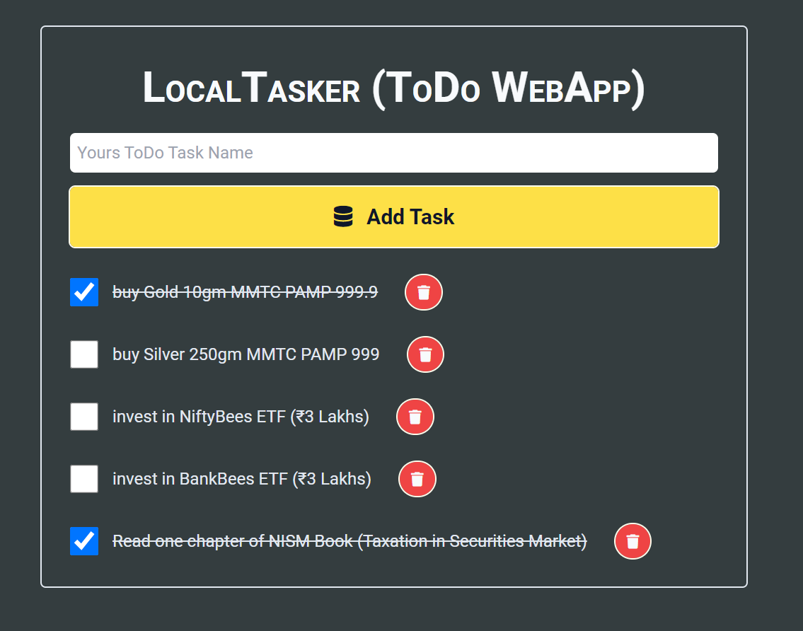

# Module#5 React Day #7 Classwork: LocalTasker (ToDo WebApp)


## Hosted Version of the Project:
[m5react-day-7-classwork-localtasker-todo-webapp](https://m5react-day-7-classwork-localtasker-todo-webapp.vercel.app/)

## Objective
LocalTasker is a lightweight and efficient ToDo application designed to assist users in managing their tasks seamlessly. This application not only allows users to create, mark as completed, and delete tasks but also utilizes local storage to persistently store tasks, ensuring data persistence between sessions.

## Features
+ Users can effortlessly create new tasks by entering task descriptions and clicking the 'Add Task' button. The application provides a quick and straightforward task input process.
+ With the 'Delete' button, users can easily remove tasks that are no longer needed. This action removes individual tasks from the list.
+ Users can mark tasks as completed by clicking on them, applying a strikethrough effect. The completed tasks remain visible for reference.
+ LocalTasker leverages local storage to store tasks persistently. This ensures that tasks are retained even when the user closes the browser or refreshes the page.
+ The 'Clear Completed' button allows users to efficiently remove all completed tasks, maintaining a clean and organized task list.

## How to install and run in yours local machine
```bash
npm install
npm run start
```

## Tech. Stack Used:
+ [React](https://react.dev/)
+ [TailwindCSS](https://tailwindcss.com/)
+ [Google Fonts](https://fonts.google.com/)
+ [Font Awesome](https://fontawesome.com/icons/)

## Author
[Abhishek kumar](https://www.linkedin.com/in/alex21c/), ([Geekster](https://geekster.in/) MERN Stack FS-14 Batch)


